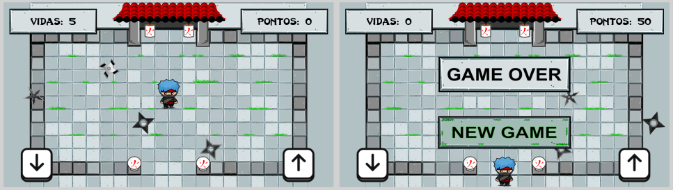

# Jogo Ninja

O jogo consiste em ajudar um ninja a atravessar uma vila cheia de shurikens passando em velocidades diferentes. O objetivo é alcançar um templo do outro lado da vila para concluir sua missão. Toda vez que se chega ao templo, a pontuação aumenta. Caso uma shuriken atinja o ninja, ele perde uma vida.

## Como surgiu

O jogo foi o resultado final do mini-curso que ministrei na Semana da Computação (SECOMP) da Universidade Estadual do Ceará (UECE) em 2018. O mini-curso teve duração de 8h.

## Screenshots

## Plataformas

Windows, Web e Android

## Controles

Teclado, Mouse e Touch:

- Setas direcionais cima e baixo movimentam o ninja
- Touch com o dedo aciona as opções de botões da interface

## Download

O jogo pode ser jogado e baixado no link: https://henriqueneto.itch.io/ninja

## Contatos

- Perfil itch.io: https://henriqueneto.itch.io
- Email: henrique.neto.dev@gmail.com
- Instagram: https://www.instagram.com/arte.henrique.neto
